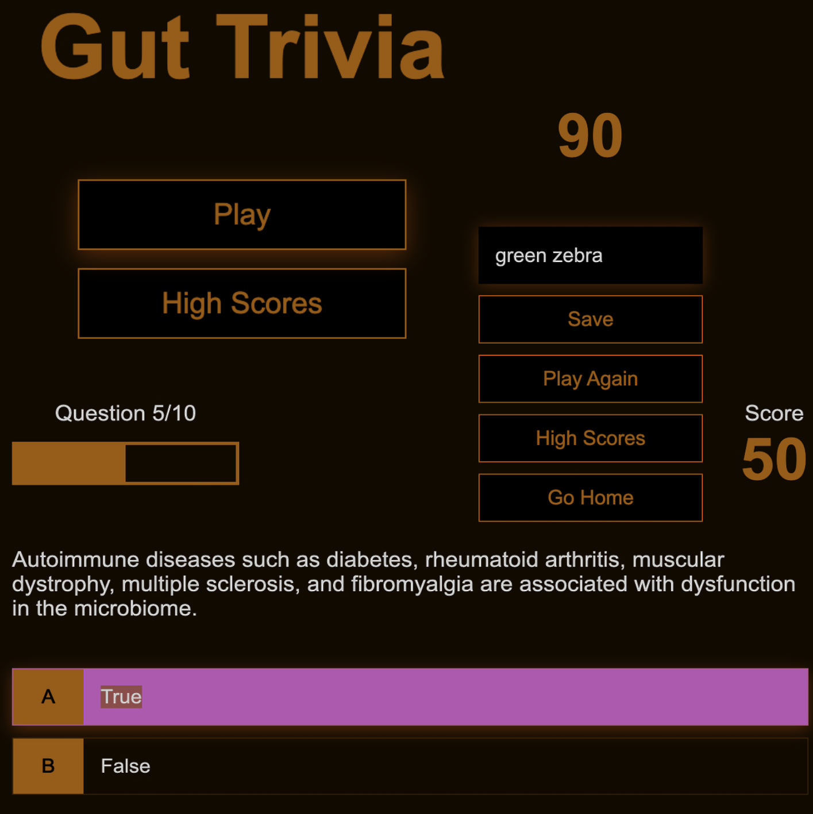

# Trivia Game

[Link to Trivia game: here](https://mejia-code.github.io/microbiome-trivia/)
Shows how to use HTML, CSS and JS only to create a quiz form.

[wip: fix save highscores]\*

## Concepts

### HUD: Heads-Up Display

> What is a HUD element?

> HUD elements could include a mini-map in the corner, a health bar, and a variety of other items to aid the player. The HUD is there to present the player with important information while not being distracting. A great example of a heads up display is in the Halo series.
